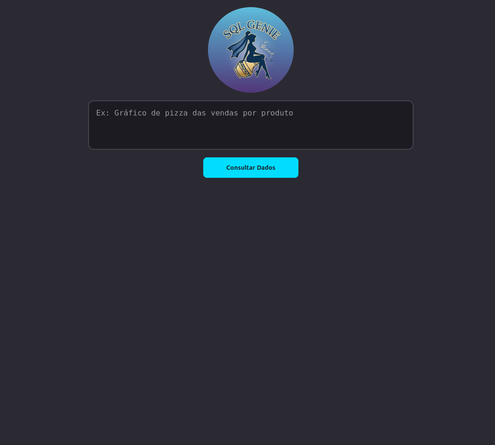

# Projeto26
Um clone do Databricks Genie

  O Databricks Genie é uma plataforma de BI que se conecta ao banco de dados e cria gráficos a partir de texto em linguagem natural.
  Este é um clone bem mais barato. Está rodando no Heroku,se conecta com um banco PostgreSQL.

  
Sistema Construído

<a href="https://www.linkedin.com/posts/cientista-de-dados1_bi-llm-sql-activity-7412608215273840640--JCG?utm_source=share&utm_medium=member_desktop&rcm=ACoAAAUblZMBhr9goiDPfQ2w_j09X_HZjjrcfYU">Veja o video do SQL Genie</a>
